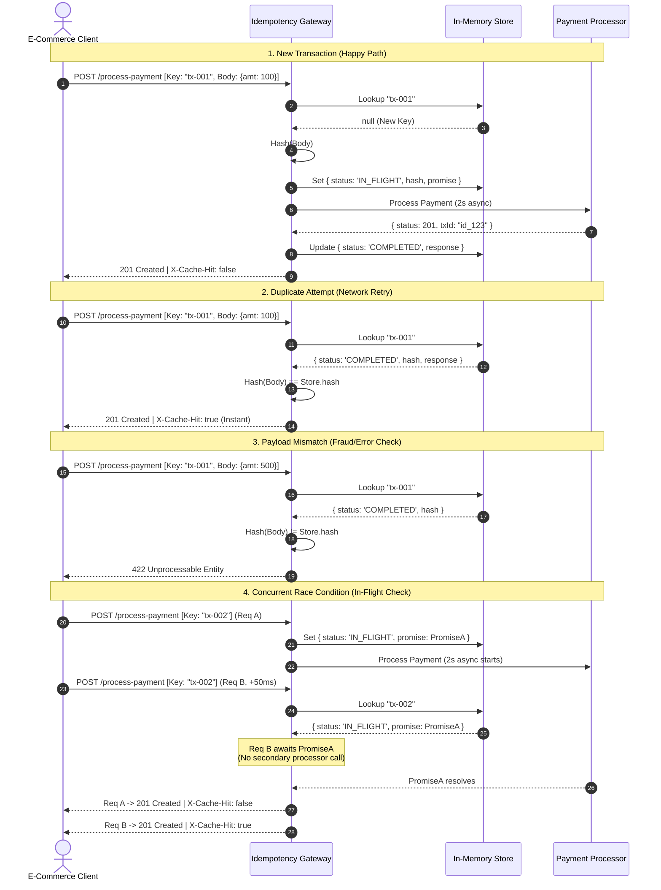

# Idempotency Gateway

## Architecture & Logic Flow

```mermaid
sequenceDiagram
    autonumber
    actor Client as E-Commerce Client
    participant Gateway as Idempotency Gateway
    participant Store as In-Memory Store
    participant Processor as Payment Processor

    %% ==========================================
    %% 1. FIRST TRANSACTION (HAPPY PATH)
    %% ==========================================
    Note over Client, Processor: 1. New Transaction (Happy Path)
    Client->>Gateway: POST /process-payment [Key: "tx-001", Body: {amt: 100}]
    Gateway->>Store: Lookup "tx-001"
    Store-->>Gateway: null (New Key)
    Gateway->>Gateway: Hash(Body)
    Gateway->>Store: Set { status: 'IN_FLIGHT', hash, promise }
    Gateway->>Processor: Process Payment (2s async)
    Processor-->>Gateway: { status: 201, txId: "id_123" }
    Gateway->>Store: Update { status: 'COMPLETED', response }
    Gateway-->>Client: 201 Created | X-Cache-Hit: false

    %% ==========================================
    %% 2. DUPLICATE ATTEMPT (CACHED HIT)
    %% ==========================================
    Note over Client, Processor: 2. Duplicate Attempt (Network Retry)
    Client->>Gateway: POST /process-payment [Key: "tx-001", Body: {amt: 100}]
    Gateway->>Store: Lookup "tx-001"
    Store-->>Gateway: { status: 'COMPLETED', hash, response }
    Gateway->>Gateway: Hash(Body) == Store.hash
    Gateway-->>Client: 201 Created | X-Cache-Hit: true (Instant)

    %% ==========================================
    %% 3. PAYLOAD MISMATCH (ERROR CHECK)
    %% ==========================================
    Note over Client, Processor: 3. Payload Mismatch (Fraud/Error Check)
    Client->>Gateway: POST /process-payment [Key: "tx-001", Body: {amt: 500}]
    Gateway->>Store: Lookup "tx-001"
    Store-->>Gateway: { status: 'COMPLETED', hash }
    Gateway->>Gateway: Hash(Body) != Store.hash
    Gateway-->>Client: 422 Unprocessable Entity

    %% ==========================================
    %% 4. IN-FLIGHT RACE CONDITION (BONUS)
    %% ==========================================
    Note over Client, Processor: 4. Concurrent Race Condition (In-Flight Check)
    Client->>Gateway: POST /process-payment [Key: "tx-002"] (Req A)
    Gateway->>Store: Set { status: 'IN_FLIGHT', promise: PromiseA }
    Gateway->>Processor: Process Payment (2s async starts)
    
    Client->>Gateway: POST /process-payment [Key: "tx-002"] (Req B, +50ms)
    Gateway->>Store: Lookup "tx-002"
    Store-->>Gateway: { status: 'IN_FLIGHT', promise: PromiseA }
    Note over Gateway: Req B awaits PromiseA<br/>(No secondary processor call)
    Processor-->>Gateway: PromiseA resolves
    Gateway-->>Client: Req A -> 201 Created | X-Cache-Hit: false
    Gateway-->>Client: Req B -> 201 Created | X-Cache-Hit: true
```
