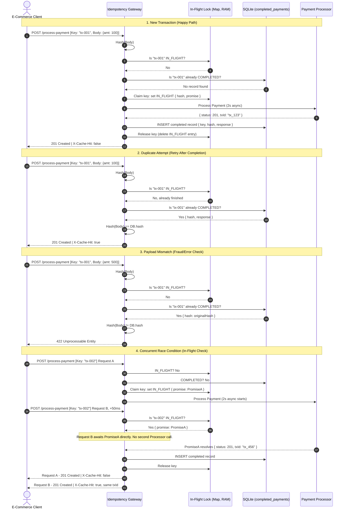

# Idempotency Gateway

## Architecture & Logic Flow




## Setup Instructions

**Requirements:** Node.js (v18 or newer recommended)

```bash
git clone https://github.com/NiloCodes/Idempotency-Gateway.git
cd Idempotency-Gateway
npm install
npm start
```

The server starts on `http://localhost:3000`. You should see:
FinSafe Idempotency Gateway listening on http://localhost:3000

A SQLite file, `idempotency.db`, is created automatically in the project root on first run — no manual database setup required.

## API Documentation

### `GET /health`

Liveness check.

**Response**
```json
{ "status": "ok" }
```

### `POST /process-payment`

**Headers**

| Header | Required | Description |
|---|---|---|
| `Content-Type` | Yes | `application/json` |
| `Idempotency-Key` | Yes | Unique string identifying this payment attempt |

**Body**
```json
{ "amount": 100, "currency": "GHS" }
```

**Responses**

| Scenario | Status | Body |
|---|---|---|
| First request with a new key | `201` | `{"message": "Charged 100 GHS", "transactionId": "tx_..."}` (`X-Cache-Hit: false`) |
| Retry with the same key + same body | `201` | Identical body and `transactionId` as the original (`X-Cache-Hit: true`), returned instantly without reprocessing |
| Same key reused with a different body | `422` | `{"error": "Idempotency key already used for a different request body."}` |
| Two identical requests arrive concurrently | `201` (both) | Both return the same `transactionId`; the first to arrive processes fresh, the second waits and returns the same result |
| Missing `Idempotency-Key` header | `400` | `{"error": "Missing 'Idempotency-Key' header."}` |
| Missing `amount` or `currency` | `400` | `{"error": "Please provide both a numeric amount and currency."}` |

**Example**

```bash
curl -i -X POST http://localhost:3000/process-payment \
  -H "Content-Type: application/json" \
  -H "Idempotency-Key: order-42" \
  -d '{"amount": 100, "currency": "GHS"}'

# => 201 Created, X-Cache-Hit: false
# {"message":"Charged 100 GHS","transactionId":"tx_1234567890"}

# Retry (simulating a client-side network timeout retry):
curl -i -X POST http://localhost:3000/process-payment \
  -H "Content-Type: application/json" \
  -H "Idempotency-Key: order-42" \
  -d '{"amount": 100, "currency": "GHS"}'

# => 201 Created, X-Cache-Hit: true, identical body — no double charge

## Testing the Advanced Scenarios

### 1. Testing the Fraud Check (Payload Mismatch)
#If a client reuses an idempotency key but alters the payment details, the gateway will block it. Run this `curl` command using the same key as before, but change the amount to 500:
curl -i -X POST http://localhost:3000/process-payment \
  -H "Content-Type: application/json" \
  -H "Idempotency-Key: order-42" \
  -d '{"amount": 500, "currency": "GHS"}'

# => 422 Unprocessable Entity
# {"error":"Idempotency key already used for a different request body."}
```


## Design Decisions

- **Two separate stores, not one.** An in-memory `Map` (`idempotencyStore`) tracks requests that are *currently being processed*, while SQLite (`completed_payments` table) permanently stores *finished* results. The Map exists purely to coordinate requests that arrive milliseconds apart; SQLite exists so a result survives a server restart or crash.
- **Why the Map check happens with no `await` in between claiming it.** Node runs JavaScript on a single thread and only switches to another request at an `await`. The sequence "check if this key is already known → claim it in the Map" runs as one uninterrupted block with no `await` in between, which is what actually prevents two simultaneous requests for a brand-new key from both starting the payment process.
- **`better-sqlite3` (synchronous) over an async SQLite driver.** For the same reason as above — an `await` inside the database lookup would reopen a gap for a race condition to slip through. Synchronous calls keep the whole check-and-claim sequence atomic.
- **Hashing the request body (SHA-256) instead of comparing it directly.** This is what Story 3 relies on: rather than storing and comparing the full payload every time, a fixed-length fingerprint is computed once and compared cheaply on every subsequent request with the same key. Object keys are sorted before hashing so field order in the JSON doesn't produce a different hash for the same data.
- **Status code choices.** `400` for malformed requests (missing header/fields — the client's fault before any processing happens), `422` for a detected key-reuse conflict, `500` for a failure during actual payment processing.

## Developer's Choice: Persisting Completed Payments to SQLite

**What:** Beyond the required in-memory idempotency check, completed payment results are persisted to a local SQLite database (`idempotency.db`), not just kept in the in-memory `Map`.

**Why:** An in-memory-only store loses every idempotency record the moment the server restarts or crashes — which is exactly the situation where a client is most likely to retry a request (e.g., after a deploy causes a brief outage). Without persistence, a retry arriving after a restart would be treated as brand new and processed (and charged) again — the exact bug this whole system exists to prevent. Persisting completed records to SQLite means a retry is recognized correctly no matter how much time has passed or how many times the server has restarted in between, while the in-memory `Map` is kept only for the short-lived "currently in progress" state that doesn't need to survive a restart anyway.
